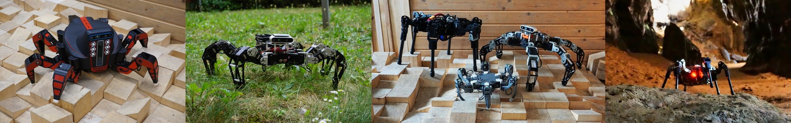

# CTU-CRAS-NORLAB Hexapod controller

[](https://comrob.fel.cvut.cz)

[](https://github.com/comrob/subt/hexapod-controller) [](https://github.com/comrob/subt/hexapod-controller/LICENSE)

This package provides a simple versatille open-loop controller for quasi-static multi-legged robots. It is the accompanying controller for the DARPA Subterranean Challenge Virtual Model Submission of `ctu_cras_norlab_lily` robot.

# Requirements
* Ubuntu 18.04
* ROS melodic

# Features
* Allows omnidirectional locomotion 
* Configurable for different platform designs with differing morphology, including up to eight legs each with 3 degrees of freedom.
* User defined body clearance and step clearance 

# Configuration
The robot parameters are configured using the `json` configuration file. For information on parameters see [readme.md](config/readme.md) in the `config` directory.

# Usage
The controller is automatically started together with the Ignition Gazebo simulation of the `ctu_cras_norlab_lily` hexapod robot.

The controller processes the robot `json` configuration file during the initialization and automatically sets the body clearance, step clearance, and maximum step length that defines the maximum velocity. Afterwards, the robot is stearable using the standard `/cmd_vel` velocity command of type `geometry_msgs/Twist`, for example:
```
rostopic pub /cmd_vel geometry_msgs/Twist "linear:
  x: 0.5
  y: 0.5
  z: 0.0
angular:
  x: 0.0
  y: 0.0
  z: 0.0"
```

Note that the vehicle moves with a constant maximum forward and angular velocity. This is a design choice and cannot be changed. Therefore the input twist command is used for weighting the maximum step length, and therefore the valid values are in range [-1,1].

Additionaly, the user may control the body clearance and step clearance by publishing appropriate masseges on the `/body_clearance` and `/step_clearance` topics. The controller accepts clearance larger than 0 as `std_msgs/Float64` messages.  


# Publications
If you use this work in an academic context, please cite the following publication.
```
@article{faigl19ras,
  title = {Adaptive Locomotion Control of Hexapod Walking Robot for Traversing Rough Terrains with Position Feedback Only},
  author = {Faigl, Jan and Čížek, Petr},
  journal = {Robotics and Autonomous Systems},
  volume = {116},
  pages = {136--147},
  year = {2019},
  doi = {10.1016/j.robot.2019.03.008},
  video = {https://youtu.be/Tdzt4yDQWI0}
}
```
> Faigl, J. and Čížek, P.: 
> **Adaptive Locomotion Control of Hexapod Walking Robot for Traversing Rough Terrains with Position Feedback Only**, 
> Robotics and Autonomous Systems, 116, 136-147, 2019.

# Licence
The software included in this package is released under a [Apache License 2.0](LICENSE) license.
